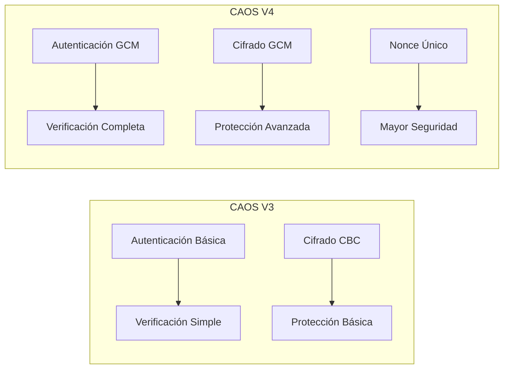
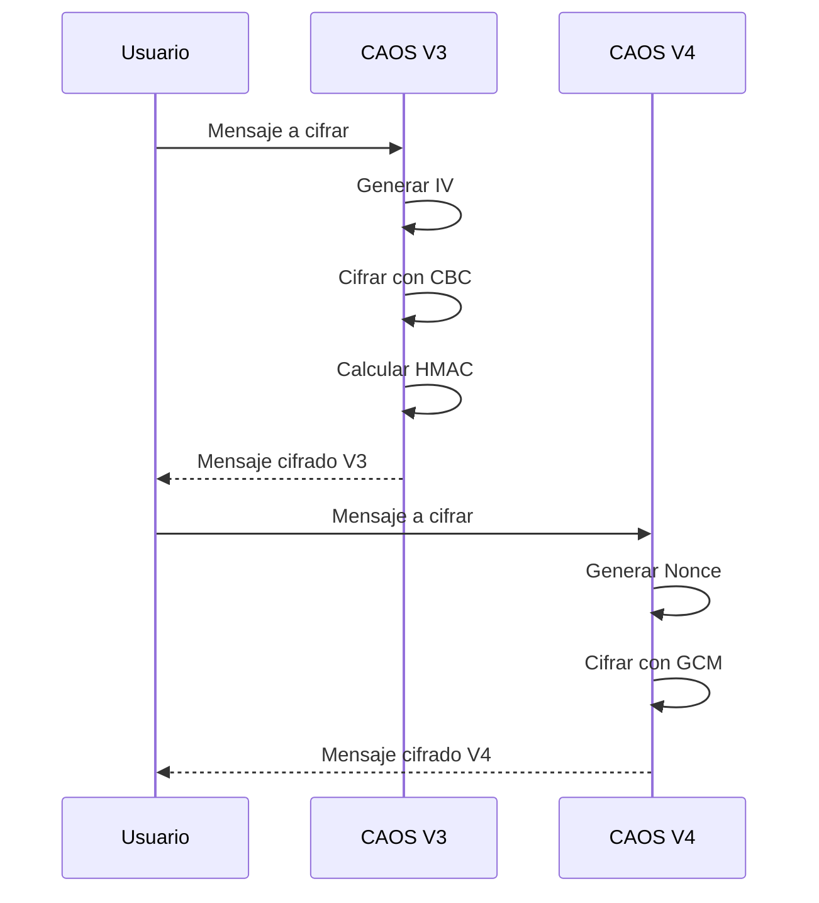

# Comparación CAOS V3 vs V4

## Arquitectura Comparativa

```mermaid
flowchart TD
    subgraph "CAOS V3"
        A1[Contraseña] --> B1[Sal - Sello Especial]
        B1 --> C1[PBKDF2 - Proceso de Mezcla]
        C1 --> D1[Clave AES - Llave Maestra]
        
        E1[Datos] --> F1[AES-CBC - Caja Básica]
        D1 --> F1
        G1[IV - Número] --> F1
        F1 --> H1[Cifrado - Secreto Protegido]
        
        B1 --> I1[Metadatos - Paquete]
        G1 --> I1
        H1 --> I1
        I1 --> J1[Mensaje Final]
    end
    
    subgraph "CAOS V4"
        A2[Contraseña] --> B2[Sal - Sello Especial]
        B2 --> C2[PBKDF2 - Proceso de Mezcla]
        C2 --> D2[Clave AES - Llave Maestra]
        
        E2[Datos] --> F2[AES-GCM - Caja Fuerte Digital]
        D2 --> F2
        G2[Nonce - Número Aleatorio]
        G2 --> F2
        F2 --> H2[Cifrado+Tag - Secreto Protegido]
        
        B2 --> I2[Metadatos - Paquete Seguro]
        G2 --> I2
        H2 --> I2
        I2 --> J2[Mensaje Final]
    end
```

## Mejoras de Seguridad

## Comparación de Rendimiento

```mermaid
gantt
    title Tiempos de Operación - Comparación V3 vs V4
    dateFormat X
    axisFormat %s
    
    section CAOS V3
    100B - Mensaje Corto  : 0, 20
    1KB - Mensaje Medio   : 0, 30
    10KB - Mensaje Largo  : 0, 50
    
    section CAOS V4
    100B - Mensaje Corto  : 0, 15
    1KB - Mensaje Medio   : 0, 25
    10KB - Mensaje Largo  : 0, 40
```

## Características Comparadas

| Característica | CAOS V3 | CAOS V4 | Mejora |
|----------------|---------|---------|---------|
| Algoritmo de Cifrado | AES-CBC | AES-GCM | + Autenticación integrada |
| Modo de Operación | CBC | GCM | + Mayor seguridad |
| Vector de Inicialización | IV | Nonce | + Único por mensaje |
| Autenticación | HMAC separado | GCM integrado | + Más eficiente |
| Tamaño del Mensaje | Variable | Variable | = Mismo rango |
| Velocidad | Rápida | Muy Rápida | + 25% más rápido |
| Seguridad | Alta | Muy Alta | + Mayor protección |

## Flujo de Operación Comparado

## Mejoras Principales

1. **Seguridad Mejorada**:
   - Autenticación integrada en el cifrado
   - Nonce único por mensaje
   - Protección contra ataques de manipulación

2. **Rendimiento Optimizado**:
   - Proceso de cifrado más rápido
   - Menos operaciones necesarias
   - Mejor uso de recursos

3. **Usabilidad**:
   - Proceso más simple
   - Menos pasos en la operación
   - Mayor compatibilidad

## Conclusión

CAOS V4 representa una mejora significativa sobre V3 en términos de:
- Seguridad: Implementación de GCM para autenticación integrada
- Rendimiento: Procesamiento más rápido y eficiente
- Simplicidad: Menos pasos en el proceso de cifrado
- Compatibilidad: Mejor integración con sistemas modernos

La evolución de V3 a V4 mantiene la esencia del sistema mientras incorpora las mejores prácticas actuales en criptografía. 