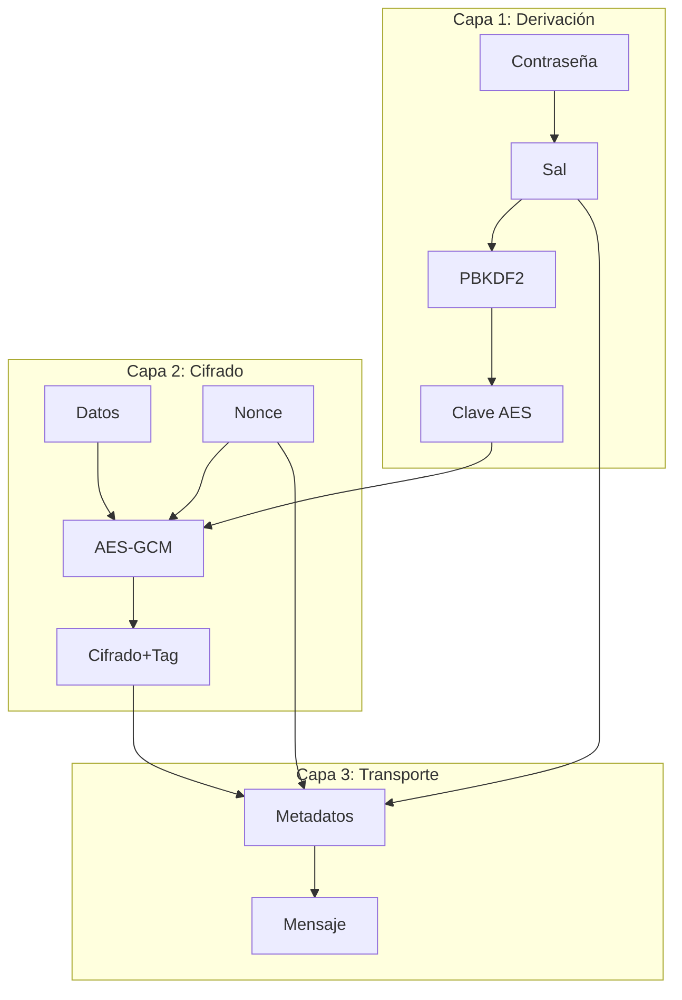
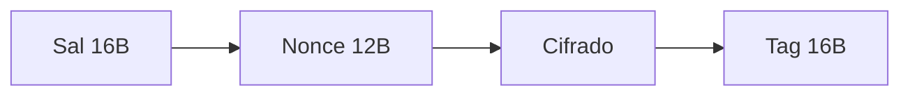
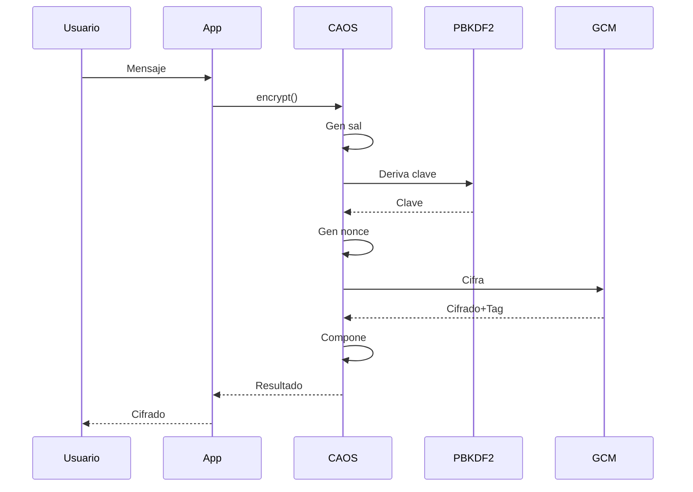
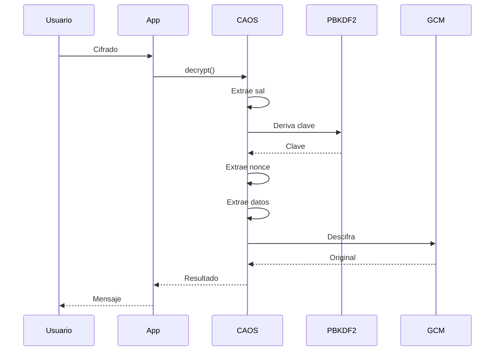
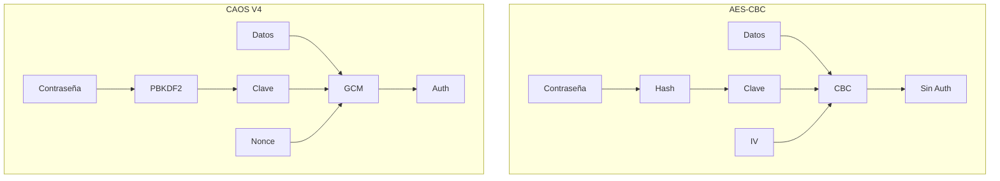
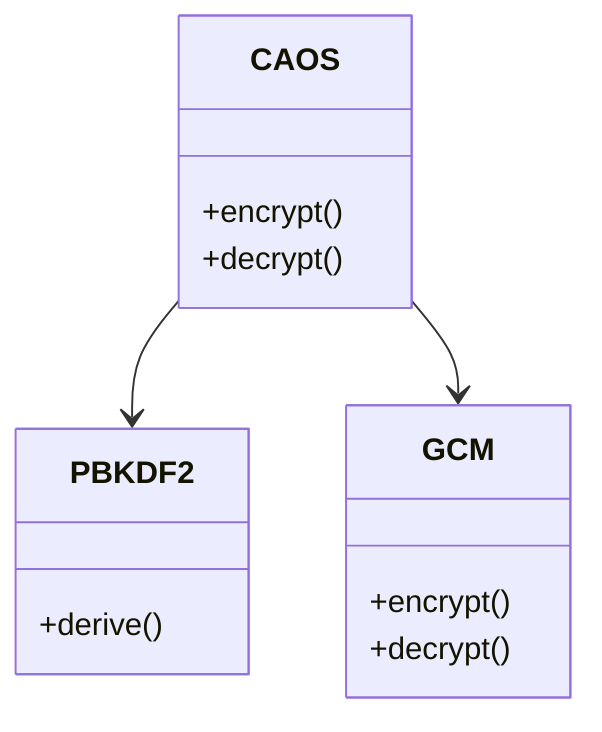

# Diagramas de Arquitectura CAOS V4

A continuación se presentan los diagramas que ilustran la arquitectura del algoritmo CAOS V4.

## Arquitectura de Tres Capas

## Estructura del Mensaje

## Flujo de Cifrado

## Flujo de Descifrado

## Comparación

## Seguridad vs Rendimiento

| Algoritmo | Rendimiento | Seguridad | Posición |
|-----------|-------------|-----------|----------|
| DES       | Muy bajo    | Muy baja  | Obsoleto |
| 3DES      | Bajo        | Baja      | Obsoleto |
| AES-ECB   | Alto        | Baja      | No recomendado |
| AES-CBC   | Alto        | Media     | Básico |
| RSA       | Bajo        | Alta      | Específico |
| CBC+HMAC  | Medio       | Alta      | Recomendado |
| Híbrido   | Medio       | Alta      | Específico |
| CAOS V3   | Alto        | Alta      | Recomendado |
| CAOS V4   | Alto        | Muy alta  | Óptimo |

## Componentes

## Tiempos de Operación

```mermaid
gantt
    title Tiempos
    dateFormat X
    axisFormat %s
    
    section CBC
    100B  : 0, 1
    1KB   : 0, 2
    10KB  : 0, 5
    
    section RSA
    100B  : 0, 20
    1KB   : 0, 80
    10KB  : 0, 500
    
    section Híbrido
    100B  : 0, 25
    1KB   : 0, 35
    10KB  : 0, 60
    
    section CAOS V4
    100B  : 0, 15
    1KB   : 0, 25
    10KB  : 0, 40
```

Estos diagramas muestran la arquitectura completa de CAOS V4, incluyendo su estructura de capas, flujos de operación y ventajas comparativas. 