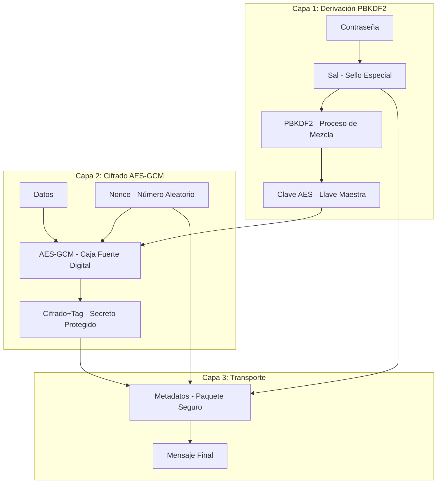
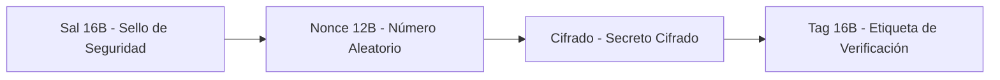
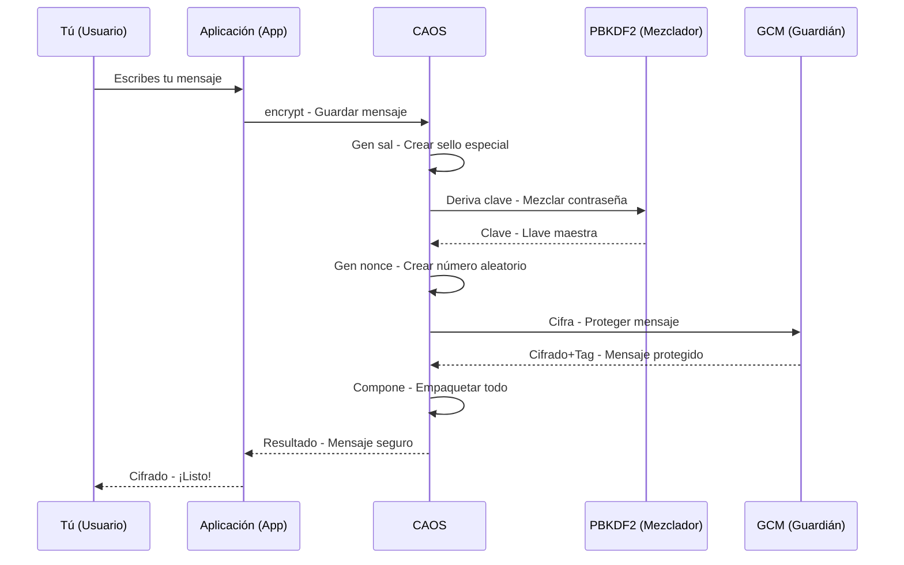
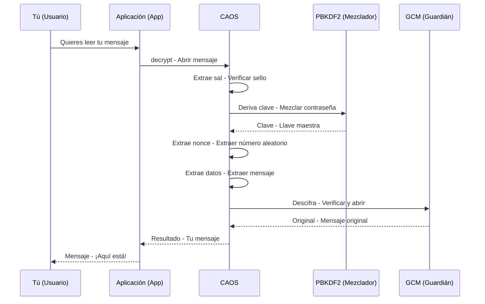
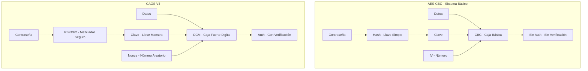
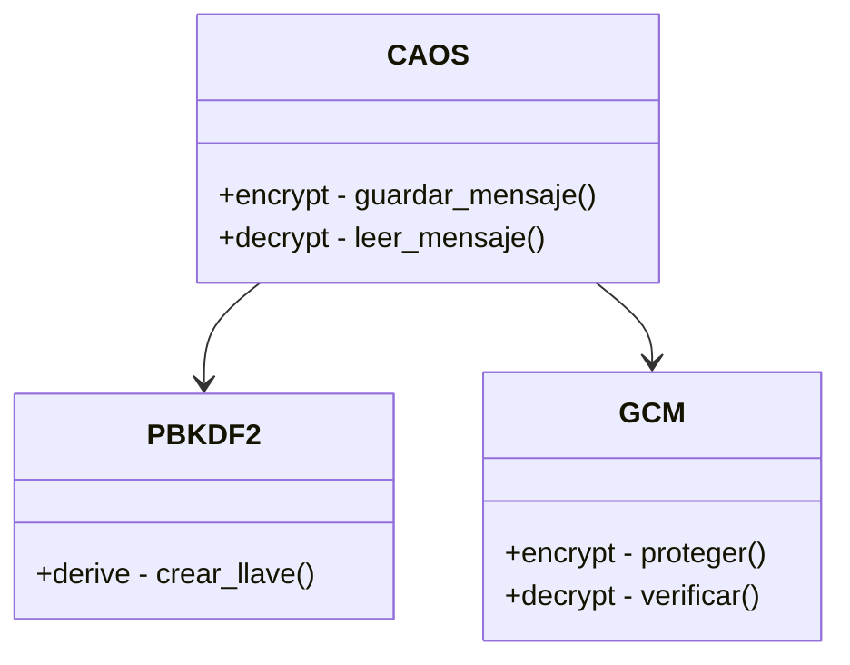

# Diagramas de CAOS V4 - Versión Técnica y Amigable

## Arquitectura de Tres Capas (Técnico) / ¿Cómo Protege CAOS V4 tus Secretos? (Amigable)

## Estructura del Mensaje (Técnico) / ¿Cómo se Guarda tu Secreto? (Amigable)

## Flujo de Cifrado (Técnico) / Proceso de Guardado (Amigable)

## Flujo de Descifrado (Técnico) / Proceso de Lectura (Amigable)

## Comparación de Sistemas (Técnico y Amigable)

## Seguridad vs Rendimiento (Técnico) / Seguridad y Velocidad (Amigable)

| Algoritmo (Técnico) | Sistema (Amigable) | Rendimiento/Velocidad | Seguridad | Posición/Recomendación |
|---------------------|-------------------|----------------------|-----------|------------------------|
| DES | Sistema Antiguo | Muy bajo/Lenta | Muy baja | Obsoleto/No usar |
| 3DES | Sistema Antiguo Mejorado | Bajo/Lenta | Baja | Obsoleto/No usar |
| AES-ECB | Sistema Básico Simple | Alto/Rápida | Baja | No recomendado/Para cosas simples |
| AES-CBC | Sistema Básico | Alto/Rápida | Media | Básico/Para cosas simples |
| RSA | Sistema Complejo | Bajo/Lenta | Alta | Específico/Para cosas muy importantes |
| CBC+HMAC | Sistema Seguro | Medio/Rápida | Alta | Recomendado/Para la mayoría de usos |
| Híbrido | Sistema Mixto | Medio/Rápida | Alta | Específico/Para usos especiales |
| CAOS V3 | Sistema Avanzado | Alto/Muy Rápida | Alta | Recomendado/Para la mayoría de usos |
| CAOS V4 | Sistema Óptimo | Alto/Muy Rápida | Muy alta | Óptimo/Para todo tipo de secretos |

## Componentes (Técnico) / Partes Principales (Amigable)

## Tiempos de Operación (Técnico) / ¿Cuánto Tarda? (Amigable)

```mermaid
gantt
    title Tiempos de Operación - Tiempo de Protección
    dateFormat X
    axisFormat %s
    
    section CBC - Sistema Básico
    100B - Mensaje Corto  : 0, 1
    1KB - Mensaje Medio   : 0, 2
    10KB - Mensaje Largo  : 0, 5
    
    section RSA - Sistema Complejo
    100B - Mensaje Corto  : 0, 20
    1KB - Mensaje Medio   : 0, 80
    10KB - Mensaje Largo  : 0, 500
    
    section CAOS V4
    100B - Mensaje Corto  : 0, 15
    1KB - Mensaje Medio   : 0, 25
    10KB - Mensaje Largo  : 0, 40
```

Estos diagramas muestran la arquitectura completa de CAOS V4, incluyendo su estructura de capas, flujos de operación y ventajas comparativas, presentados tanto en términos técnicos como en un lenguaje más amigable para facilitar la comprensión. 